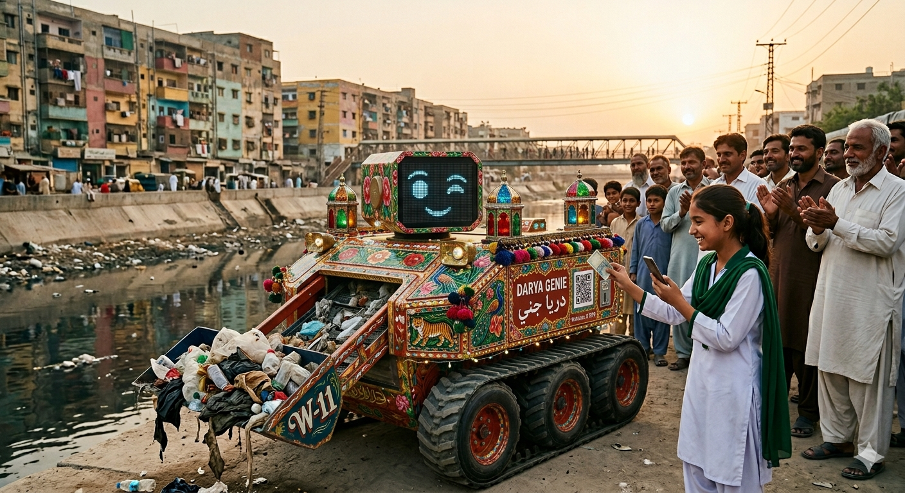
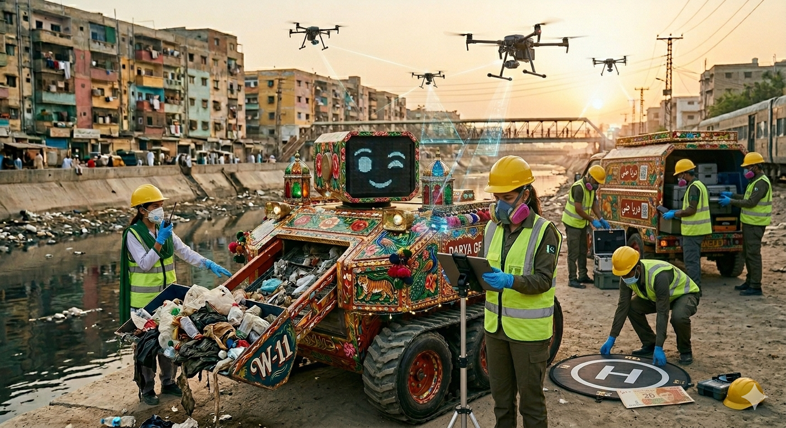

# Darya Genie (دريا جني) 🌊🤖

> **Grassroots, community-funded robotic river restoration for the Lyari Basin, Karachi.**

Darya Genie is an open-source, decentralized civic-tech initiative designed to bypass institutional gridlock and clean up urban waterways. By combining low-cost autonomous waste-harvesting hardware with a culturally resonant, interactive mascot and a micro-equity donation loop, we shift the environmental narrative from "the state's problem" to a community-owned triumph.

## Concept Visuals


*Darya Genie UGV concept illustration.*


*Illustration of drone swarm coordinating with UGV for hopeful healing of the river.*

## Repository Structure

This repository is organized as follows:

```
├── hardware/              # UGV chassis CAD files, wiring schematics, and BOM
├── firmware/              # Microcontroller code for motor drivers and LED matrix
│   └── motor_controller/  # PlatformIO project for ESP32 with micro-ROS
├── src/
│   ├── genie_brain/       # ROS 2 package for navigation and vision
│   ├── payment_gateway/   # FastAPI server for mobile wallet webhooks
│   └── api/               # Authentication and certification middleware
├── docs/                  
│   ├── safety/            # Darya Safety-First Certification Course (45-min curriculum)
│   │   ├── module_01_safety.md      # Hazard identification and PPE
│   │   ├── module_02_equipment.md   # Equipment handling and protocols
│   │   ├── module_03_environment.md   # River toxin awareness and decon
│   │   └── assessment_quiz.md       # Final competency assessment
│   ├── CURRICULUM.md      # Educational outreach materials
│   ├── DRONE_PROTOCOLS.md # Drone-to-UGV coordination protocols
│   ├── SECURITY_AND_ASSET_PROTECTION.md # Asset protection and security policy
│   └── ANTI_GAMING_AND_MATERIAL_INTEGRITY_PROTOCOL.md # Anti-fraud for drop-hub incentive system
├── scripts/
│   └── certification_gatekeeper.py  # Validates quiz and updates User_Registry
└── tests/                 # Hardware-in-the-loop (HIL) simulation scripts
```

## 💰 Financial Transparency & Worker Welfare (Year 01 Only)

Traditional top-down river restoration initiatives for the Lyari Basin carry massive, gridlocked budgets (such as the S-III plan's **~$150M CAD / PKR 43B** allocation), which frequently suffer from bureaucratic friction and low deployment execution. 

Darya Genie completely flips this paradigm. We treat **Worker Welfare as our Alcoa Keystone Habit**—inspired by Charles Duhigg's *The Power of Habit*. We believe that by fiercely protecting, properly feeding, and aggressively investing in our frontline team, we automatically secure operational safety, technical discipline, and unshakeable community trust. 

Our expanded **Year 01 Pilot Target is $320,000 CAD**, built explicitly to eliminate hand-to-mouth precarity, establish multi-domain aerial scouting operations, and design a high-mobility leadership pipeline:

| Phase / Budget Category | Year 01 Allocation (CAD) | Cornerstone Utility & Worker Welfare Impact |
| :--- | :--- | :--- |
| **Core Salaries & Management** | $145,000 | Guarantees living wages for ground technicians, drone operators, a part-time deployment driver, a Technical Trainer, and a full-time project General Manager. |
| **Drone Hardware & Logistics** | $45,000 | Procuring a multi-drone aerial reconnaissance fleet, custom climate-controlled storage cases, and a secure mobile logistics truck to transport the UGV and drones safely. |
| **Aviation Safety & Certifications** | $20,000 | Earmarked for official Civil Aviation Authority (CAA) commercial drone licensing, rigorous field safety training courses, and operational insurance. |
| **Upward Mobility & Executive Training** | $40,000 | Structured 2-to-3 year fast-track program. Earmarked funds for leadership workshops, advanced robotics upskilling, and business management training to transition field workers into future Directors. |
| **Holistic Support, Meals & Office Care** | $35,000 | Daily high-nutrition catered meals for all ground and aerial crew, field health checks, high-grade personal protective equipment (PPE), and air-conditioned office workspaces, with showers and a place to take naps |
| **Core Ground Autonomy (UGV)** | $25,000 | Rugged tracked UGV chassis fabrication, Jetson/Raspberry Pi compute blocks, conveyor mechanics, sealed sensor suites, and local W-11 truck art styling. |
| **Micro-Incentive Seeding** | $10,000 | Initial liquidity to back local community collection drop-hubs for immediate wallet payouts. This complements robot operations by incentivizing fine-detail collection in narrow banks/alleys unreachable by UGV, creating a "Micro-Equity Loop" where citizens become restoration partners. See [Anti-Gaming Protocol](/docs/ANTI_GAMING_AND_MATERIAL_INTEGRITY_PROTOCOL.md) for fraud prevention measures. |

*Every 5-rupee (or 20 rupee) micro-donation processed by the gateway flows directly into sustaining local incentive liquidity, protecting team welfare, and supporting hardware maintenance.*

### 📈 The Micro-Equity Scalability Model (The 20/20 Projection)

To understand the mathematical velocity of decentralized civic tech, consider this hyper-conservative baseline projection for Karachi's urban density:

* **Target Activation:** 20% of Karachi's projected population (~4.62 Million active community participants).
* **Micro-Equity Quantum:** A single, one-time donation of **20 PKR (~$0.07 CAD)** per person.

$$\text{Total Capital} = 4,620,000 \times 20\text{ PKR} = 92,400,000\text{ PKR}$$

This single, low-friction activation wave yields approximately **$322,300 CAD**. 

#### ⚡ The Operational Reality Shift
1. **Instant Self-Sovereignty:** This single loop completely clears our expanded **Year 01 Pilot Budget ($320,000 CAD)**, securing premium living wages, drone safety certifications, mobile logistics, and hardware fabrication with an immediate cash reserve to seed Year 02.
2. **Infinite Compound Runway:** If this same 20% cohort triggers a 20 PKR transaction just once per quarter, the platform generates over **$1.2 Million CAD annually**—fully funding a multi-robot fleet, localized aerial monitoring, and a permanent local leadership pipeline without a single cent of institutional debt or state intervention.

## Safety & Certification Pipeline

Darya Genie operates on the fundamental principle that **safety certification is a prerequisite for participation**. All community collectors, drone operators, and field personnel must complete the **Darya Safety-First Certification Course** before engaging in river cleanup activities. This 45-minute curriculum is version-controlled and auditable.

```
README.md → /docs/safety/ → /scripts/certification_gatekeeper.py → /src/api/auth.py → User.is_certified = True
```

### Path to Certified Collector

1. **Curriculum Access:** Participants complete the 3-module safety course (`/docs/safety/module_01-03_*.md`) covering hazards, equipment handling, and toxin awareness.
2. **Assessment Validation:** `certification_gatekeeper.py` validates the final quiz and updates the User_Registry via `POST /api/certify` upon passing.
3. **Payment Gateway Enforcement:** `/src/api/auth.py` middleware checks `User.is_certified == True` before processing any micro-incentive payout.

For full curriculum details and certification requirements, see the [`/docs/safety/`](/docs/safety/) directory.

---

## 🔒 Security & Asset Protection

For a detailed breakdown of our multi-domain physical, technical, and social security protocols, please review the [Security & Asset Protection Protocol](/docs/SECURITY_AND_ASSET_PROTECTION.md).

## Credits

- [Kilo - Nvidia Nemotron 3 Super(free)](https://github.com/Kilo-Org/kilocode) for helping update the README and helping develop the very first iteration of the codebase
- [Gemini by Google](https://gemini.google.com/) as the original brainstorming partner.
- [@genidma](https://github.com/genidma) for the origination of the idea.
- [Qoder](https://qoder.com/) (formerly Lingma) for helping link the image to the README.