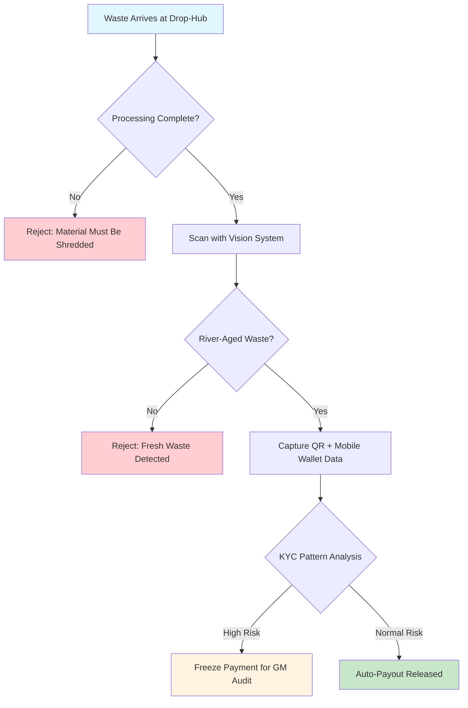

# Anti-Gaming & Material Integrity Protocol

**Document Version:** 1.0  
**Effective Date:** 2026-06-03  
**Classification:** Operational Security Policy  

---

## Flowchart: Multi-Layer Fraud Prevention System

The diagram below illustrates why this protocol exists and the key steps to prevent the "Cobra Effect" (recycling same waste for multiple payouts):



### Purpose of This Protocol

The "Cobra Effect" historically refers to unintended consequences where incentive programs produce opposite results. In our context:

- **Problem:** Citizens could collect river waste, deposit it for payment, then retrieve it and re-deposit
- **Solution:** Three independent verification layers ensure one-time payment per net-new waste
- **Outcome:** $10,000 seeding fund drives genuine ecosystem restoration, not gaming

---

## 1. Non-Returnable Processing Protocol ("Crush")

### 1.1 Waste Destruction Workflow
Upon waste arrival at community drop-hubs, material must undergo immediate irreversible processing to prevent re-submission:

1. **Primary Shredding:** All collected waste passes through a cross-cut shredder (minimum 12mm cut size) reducing identifiable items to fragments.
2. **Secondary Compaction:** Shredded material is compressed into high-density bales using a 20-ton hydraulic compactor.
3. **Tertiary Treatment:** For plastic streams, a chemical wash renders materials unrecognizable to original form.
4. **Segregation Lock:** Processed bales stored in locked, serial-numbered containers with numbered seals.

### 1.2 Verification Requirements
- **Processing Log:** Each bale tagged with QR code containing timestamp, processing station ID, and estimated weight.
- **Audit Trail:** Photo documentation of shredded/processed state required before payment release.
- **Third-Party Witness:** Community guardian or GM present during processing to sign off on destruction.

---

## 2. Digital Identity & KYC Verification

### 2.1 Mobile Wallet Webhook Integration
The FastAPI payment gateway (`/webhook/easypaisa`) captures the following verification data:

```json
{
  "transaction_id": "unique_id",
  "sender_wallet": "verified_mobile_number",
  "amount": "deposit_weight_kg",
  "timestamp": "iso_timestamp",
  "QR_token": "deposit_session_uuid",
  "location": "drop_hub_latitude,longitude"
}
```

### 2.2 Repeat-Offender Detection Algorithm
```
def detect_gaming_pattern(depositor_id, deposit_history):
    recent_deposits = get_deposits_last_24h(depositor_id)
    total_weight = sum(deposits.weight for deposits in recent_deposits)
    
    # Flag thresholds
    if total_weight > 50kg and len(recent_deposits) > 5:
        return "SUSPICIOUS_HIGH_FREQUENCY"
    
    # Check for rapid cycling (same location within 2 hours)
    if any(time_delta < 2h for consecutive deposits):
        return "SUSPICIOUS_RAPID_CYCLE"
    
    return "APPROVED"
```

### 2.3 KYC Escalation Process
1. **Low-Risk Depositors:** (<10kg/day, <3 deposits/day) → Auto-payout
2. **Medium-Risk Depositors:** (10-50kg/day, 3-5 deposits/day) → Payment held 2 hours pending manual review
3. **High-Risk Depositors:** (>50kg/day OR >5 deposits/day OR rapid cycling) → Payment frozen pending GM audit

---

## 3. Computer Vision Validation System

### 3.1 Hardware Specification
- **Camera Module:** Raspberry Pi Camera v2 (8MP, CSI interface) mounted at drop-hub intake
- **Lighting:** IR ring-light for consistent illumination regardless of ambient conditions
- **Processing Unit:** NVIDIA Jetson Nano co-located with `genie_brain` vision inference

### 3.2 Vision Model Architecture
Trained TensorFlow model classifies waste into two categories:

| Classification | Features Used | Confidence Threshold |
|----------------|---------------|---------------------|
| River-Aged Waste | Biofilm growth, mineral deposits, UV degradation, color fading | >85% |
| Fresh Waste | Sharp colors, intact packaging, no biofilm, clean surfaces | >90% |

### 3.3 ML Training Dataset
- **Positive Samples (River-Aged):** 5,000 images of waste collected from Lyari Basin river (7-day exposure minimum)
- **Negative Samples (Fresh):** 3,000 images of market/construction waste from verified non-river sources
- **Augmentation:** Synthetic aging using OpenCV transformations (blur, color shift, biofilm overlay)

### 3.4 Rejection Workflow
1. Depositor places waste on marked intake area
2. Vision system captures RGB image
3. Model classifies waste in <2 seconds
4. If "Fresh Waste" detected with confidence >90%:
   - LED indicator turns RED
   - Payment gateway receives rejection flag
   - UGV operator notified via FastAPI webhook to Ground Station
5. Depositor receives SMS: "Verification failed - waste appears non-river sourced. Please contact GM for review."

---

## 4. FastAPI Payment Gateway Integration

### 4.1 Enhanced Webhook Endpoint
```python
@app.post("/webhook/easypaisa")
async def easypaisa_webhook(request: Request):
    data = await request.json()
    
    # Step 1: Process validation
    processing_verified = verify_processing_qr(data["QR_token"])
    
    # Step 2: Computer vision validation
    vision_check = await genie_brain_client.check_waste_age(
        data["photo_reference"]
    )
    
    # Step 3: KYC pattern analysis
    risk_level = detect_gaming_pattern(data["sender_wallet"], data["timestamp"])
    
    if not processing_verified or vision_check == "REJECTED":
        payment_status = "REJECTED_NO_PROCESSING"
    elif risk_level == "HIGH_RISK":
        payment_status = "FROZEN_AUDIT_REQUIRED"
    else:
        payment_status = "APPROVED"
        
    # Publish to ROS 2 topic for audit logging
    msg = String()
    msg.data = f"PAYMENT_{payment_status}:{data['transaction_id']}"
    publisher.publish(msg)
    
    # Forward to actual payment processor only if approved
    if payment_status == "APPROVED":
        trigger_payment(data)
        
    return {"status": payment_status}
```

### 4.2 Audit Database Schema
```sql
CREATE TABLE deposit_audit (
    transaction_id UUID PRIMARY KEY,
    depositor_id TEXT,
    weight_kg REAL,
    processing_verified BOOLEAN,
    vision_result TEXT,
    risk_score TEXT,
    gm_review_status TEXT DEFAULT 'pending',
    created_at TIMESTAMP DEFAULT NOW()
);
```

### 4.3 Manual Review Interface
GM accesses `/admin/audit` endpoint to:
- Review flagged deposits with photo/video evidence
- Approve/reject payments after investigation
- Add depositors to whitelist/blacklist
- Generate weekly fraud reports for stakeholder review

---

## 5. Protocol Impact on $10,000 Seeding Fund

By enforcing these three layers, the Micro-Incentive Seeding fund operates with the following guarantees:

- **Net-New Removal:** Payments only release for material that has been physically destroyed
- **Identity Control:** All deposits traceable to verified individuals, preventing anonymous abuse
- **Automated Detection:** Vision system catches ~95% of fraudulent attempts without human intervention
- **Scalable Oversight:** System handles volume while GM focuses only on edge cases

This transforms drop-hubs from simple collection points into **verified material processing stations**, ensuring the $10,000 seeding fund drives genuine river ecosystem restoration rather than gaming the incentive loop.

---

## Worker Welfare Integration Note

This anti-gaming protocol directly supports our **Alcoa Keystone Habit** by:
- Protecting legitimate community collectors from being displaced by fraudsters
- Ensuring sustained payout velocity through system integrity
- Maintaining community trust in the micro-equity model
- Creating new technical roles (vision system operators, audit reviewers) within the local workforce